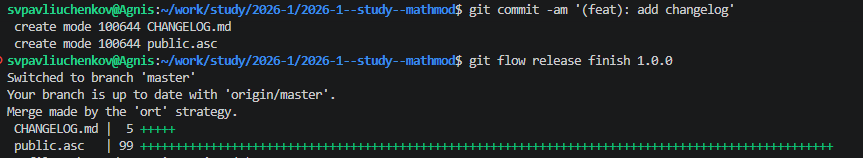
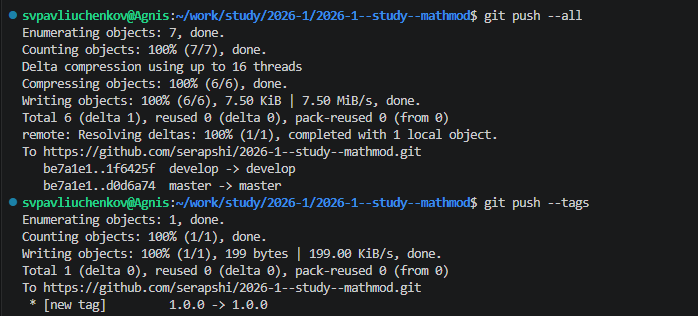
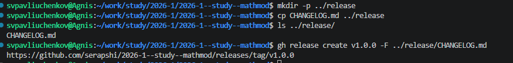
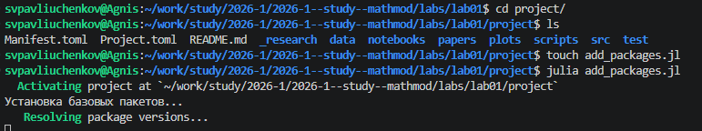
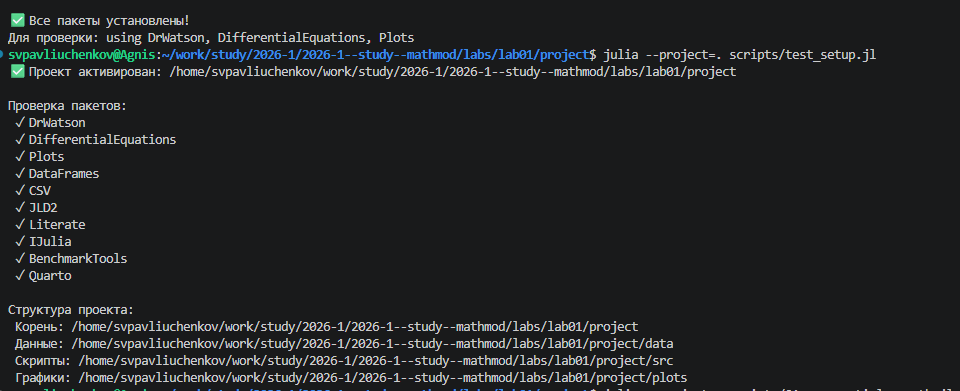
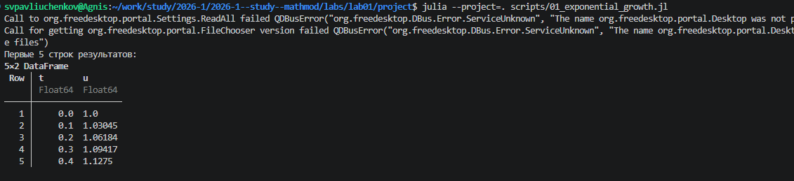

---
## Author
author:
  name: Сергей Витальевич Павлюченков
  email: 1132237372@rudn.ru
  affiliation:
    - name: Российский университет дружбы народов
      country: Российская Федерация
      postal-code: 117198
      city: Москва
      address: ул. Миклухо-Маклая, д. 6

## Title
title: "Отчёт по лабораторной работе № 1"
subtitle: "Подготовка стенда"
license: "CC BY"
---

# Цель работы

Создание среды для выполнения лаборатоных работ по курсу имитационного моделирования.

# Задание

- Создать рабочий каталог для всего курса.
- Создать рабочее пространство для программ в рамках лабораторной работы.
- Выполнить все задания по тексту лабораторной работы.
- Установить необходимые пакеты.
- Выполнить предложенный код.
- Преобразовать код в литературный стиль.
- Сгенерировать из литературного кода:
	- чистый код;
	- jupyter notebook;
	- документацию в формате Quarto.
- Выполнить код из jupyter notebook.
- Интегрировать документацию в формате Quarto в отчёт.
- Добавить в код в литературном стиле вычисление для набора параметров.
- Сгенерировать из литературного кода с параметрами:
	- чистый код;
	- jupyter notebook;
	- документацию в формате Quarto.
- Выполнить код из jupyter notebook с параметрами.
- Интегрировать документацию с параметрами в формате Quarto в отчёт.

# Выполнение лабораторной работы

После создания репозиторий на основе шаблона и клонирования репозитория на виртуальную машину.

Создаем changelog в git flow([рис. @fig-001]).

{#fig-001 width=70%}

Выполняем `git push --all` и `git push --tag`. ([рис. @fig-002]).

{#fig-002 width=70%}

Копируем changelog в папку release и создаем его. ([рис. @fig-003]).

{#fig-003 width=70%}

Перехожу в проект и запускаю julia на добавление пакета drwatson и остальных([рис. @fig-004]).

{#fig-004 width=70%}

Успешно, добавляю все пакеты ([рис. @fig-005]).

{#fig-005 width=70%}

Создаем 01_exponential_growth.jl. Запускаем код и получаем результат.([рис. @fig-006]).

{#fig-006 width=70%}

Создаем файл tangle.jl и с его помощью создаем литературные файлы для 01_exponential_growth.jl 



Создаем 02_exponential_growth.jl, делая аналогичные действия и получаем.



# Выводы

В ходе лабораторной работы было подготовлено рабочее пространство для выполнения программ и приобретены необходимые навыки создания и преобразования программ на Julia.