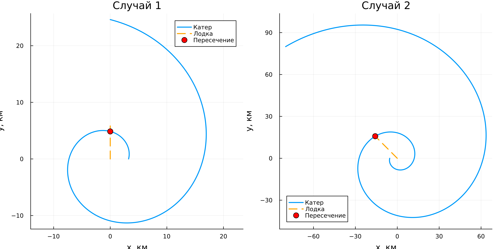
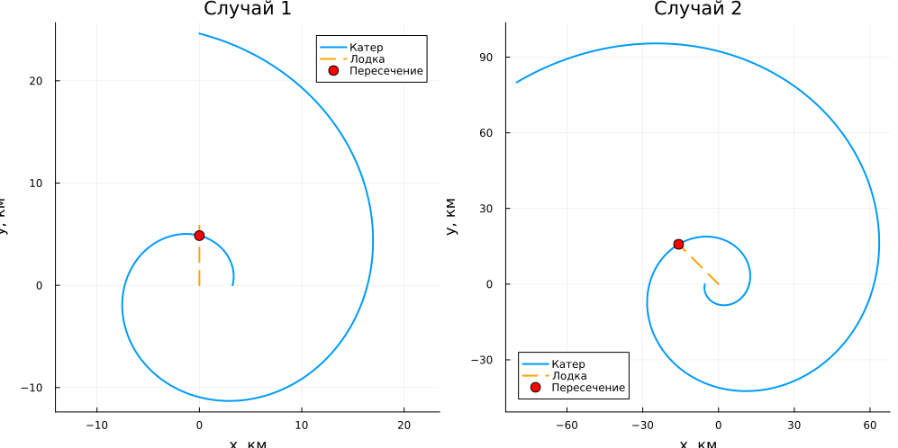
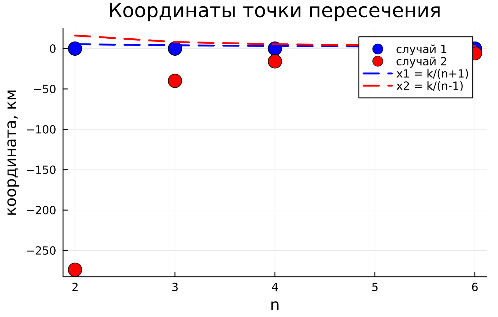

---
## Author
author:
  name: Сергей Витальевич Павлюченков
  email: 1132237372@rudn.ru
  affiliation:
    - name: Российский университет дружбы народов
      country: Российская Федерация
      postal-code: 117198
      city: Москва
      address: ул. Миклухо-Маклая, д. 6
## Title
title: Лабораторная работа №2
subtitle: Математическое моделирование
license: CC BY
date: today
date-format: "YYYY-MM-DD" # Example: 2025-09-06
---

## Докладчик

:::::::::::::: {.columns align=center}
::: {.column width="70%"}

  * Павлюченков Сергей Витальевич
  * Студент группы НКНбд-01-23
  * Российский университет дружбы народов им. П. Лумумбы

:::
::: {.column width="30%"}

:::
::::::::::::::

# Вводная часть

## Цели и задачи

Изучить построение математической модели задачи о погоне: вывести дифференциальные уравнения движения катера при заданном отношении скоростей и построить траектории катера и лодки для нахождения точки их пересечения.

## Условие задачи

На море в тумане катер береговой охраны преследует лодку браконьеров. Туман рассеивается, лодка обнаружена на расстоянии 16,2 км от катера, после чего уходит прямолинейно в неизвестном направлении. Скорость катера в 4 раза больше скорости лодки.

Исходные данные: $k = 16{,}2$ км, $n = 4$.

## Математическая модель

Рассматриваются два случая расположения катера относительно лодки в начальный момент времени.

## Два производных файла и запускаю notebook. 

{#fig-0041 width=50%}

# Результаты

## Базовый эксперимент 
{#fig-002 width=70%}

## график для двух случаев.

{#fig-003 width=70%}

## Точка пересечения в зависимости от n 
{#fig-004 width=70%} 

## Вывод

- Научился формулировать задачу о погоне и выводить дифференциальное уравнение траектории.
- Построенные графики позволили найти точку пересечения траекторий катера и лодки.

