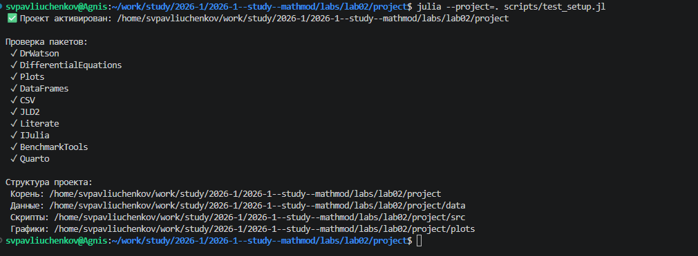
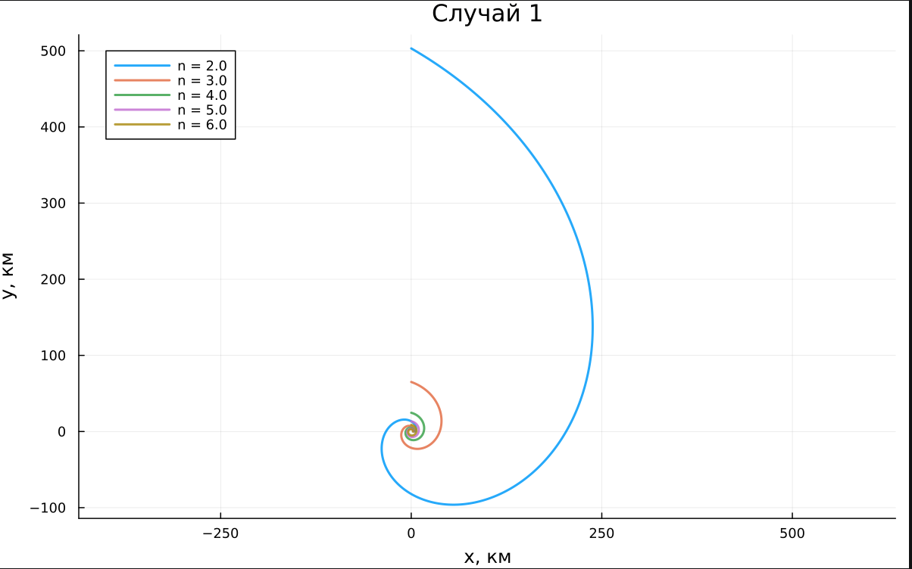
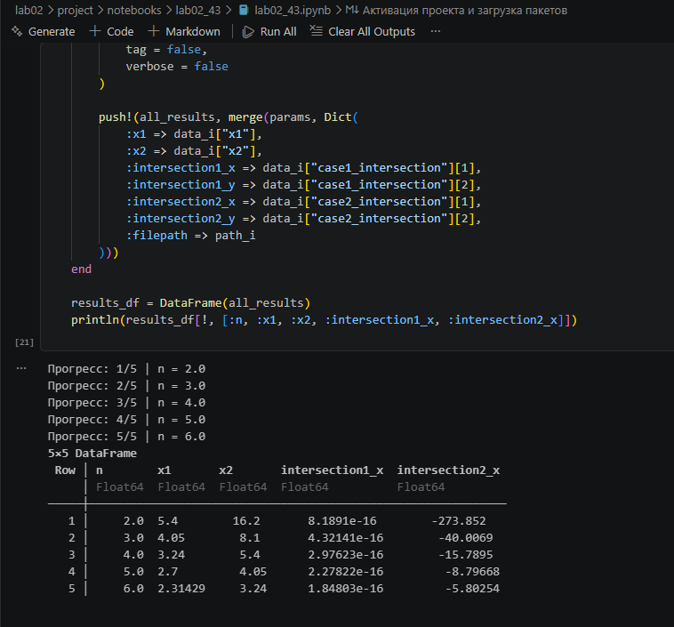

---
## Author
author:
  name: Сергей Витальевич Павлюченков
  email: 1132237372@rudn.ru
  affiliation:
    - name: Российский университет дружбы народов
      country: Российская Федерация
      postal-code: 117198
      city: Москва
      address: ул. Миклухо-Маклая, д. 6

## Title
title: "Отчёт по лабораторной работе № 2"
subtitle: "Задача о погоне"
license: "CC BY"
---

# Цель работы

Изучить построение математической модели задачи о погоне, вывести дифференциальные уравнения движения катера при заданном отношении скоростей и построить траектории движения катера и лодки для определения точки их пересечения.

# Задание

**Вариант 43.** На море в тумане катер береговой охраны преследует лодку браконьеров. Через определённый промежуток времени туман рассеивается, и лодка обнаруживается на расстоянии 16,2 км от катера. Затем лодка снова скрывается в тумане и уходит прямолинейно в неизвестном направлении. Известно, что скорость катера в 4 раза больше скорости браконьерской лодки.

1. Записать уравнение, описывающее движение катера, с начальными условиями для двух случаев (в зависимости от расположения катера относительно лодки в начальный момент времени).
2. Построить траекторию движения катера и лодки для двух случаев.
3. Найти точку пересечения траектории катера и лодки.

Исходные данные: $k = 16{,}2$ км, $n = 4$.

# Выполнение лабораторной работы

С помощью add_packages.jl я добавил нужные пакеты. ([рис. @fig-001]).

{#fig-001 width=70%}

Создаю lab02_43.jl и получаю график для двух случаев. ([рис. @fig-002]).

{#fig-002 width=70%}

Учитывая полученное уравнение, для первого случая мы строим несколько графиков на одном для сравнения траектории движения катера. ([рис. @fig-003]).

{#fig-003 width=70%}

Два производных файла и запускаю notebook. ([рис. @fig-004]).

{#fig-004 width=70%}



# Выводы

Хотя работает, я научился формулировать задачу о погоне и вывод дифференциального уравнения траектории лодки. Построенные графики позволили нам найти точку пересечения траектории катера с лодкой. 