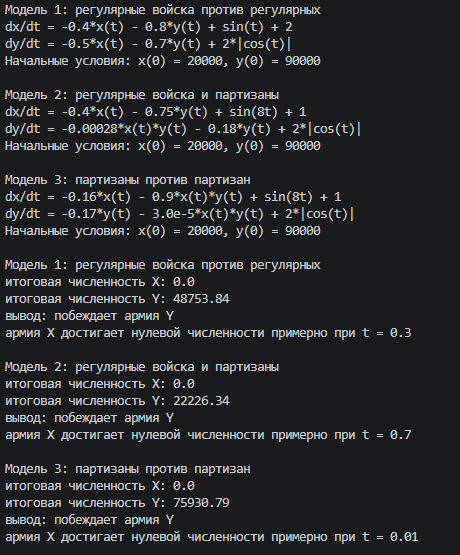
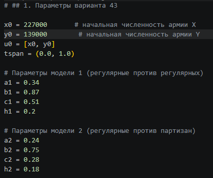
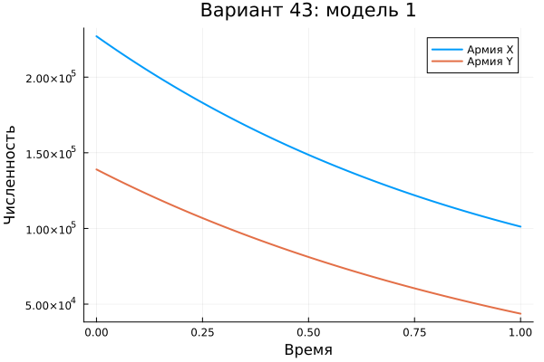
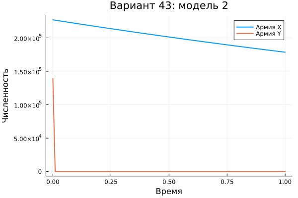
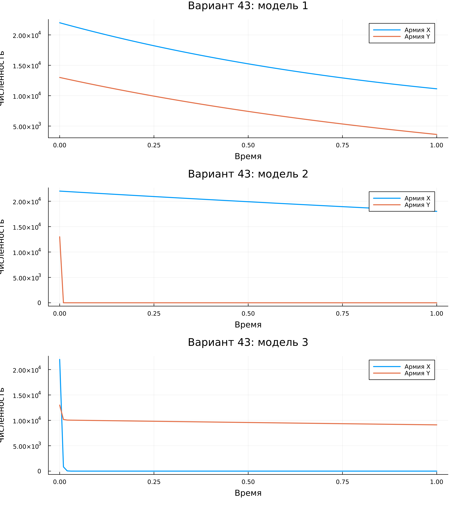

---
## Author
author:
  name: Сергей Витальевич Павлюченков
  email: 1132237372@rudn.ru
  affiliation:
    - name: Российский университет дружбы народов
      country: Российская Федерация
      postal-code: 117198
      city: Москва
      address: ул. Миклухо-Маклая, д. 6
## Title
title: Лабораторная работа №3
subtitle: Математическое моделирование
license: CC BY
date: today
date-format: "YYYY-MM-DD" # Example: 2025-09-06
---

# Информация

## Докладчик

:::::::::::::: {.columns align=center}
::: {.column width="70%"}

  * Павлюченков Сергей Витальевич
  * Студент группы НКНбд-01-23
  * Российский университет дружбы народов им. П. Лумумбы

:::
::: {.column width="30%"}

:::
::::::::::::::

# Вводная часть

## Цели и задачи

**Вариант 43.** Между страной X и страной Y идёт война. Численность войск исчисляется от начала войны и является функциями времени $x(t)$ и $y(t)$. В начальный момент времени страна X имеет армию численностью 227 000 человек, а в распоряжении страны Y армия численностью 139 000 человек. Для упрощения модели считаем, что коэффициенты $a, b, c, h$ постоянны, а $P(t)$ и $Q(t)$ — непрерывные функции.

Построить графики изменения численности армий X и Y для следующих случаев.

##  Параметры вариант 43

1. Модель боевых действий между регулярными войсками:
$$\begin{cases} \dfrac{dx}{dt} = 0{,}34x(t) + 0{,}87y(t) + \sin(t) + 2 \\ \dfrac{dy}{dt} = 0{,}5x(t) + 0{,}2y(t) + 2|\cos(t)| \end{cases}$$
2. Модель ведения боевых действий с участием регулярных войск и партизанских отрядов:
$$\begin{cases} \dfrac{dx}{dt} = 0{,}24x(t) + 0{,}75y(t) + \sin(8t) + 1 \\ \dfrac{dy}{dt} = 0{,}28x(t)y(t) + 0{,}18y(t) + 2|\cos(t)| \end{cases}$$

Начальные условия: $x(0) = 227\,000$, $y(0) = 139\,000$.

# Выполнение

## Симуляция 1

{#fig-001 width=50%}

## После чего взяв эффективный из варианта, подробнее на картинке

{#fig-003 width=40%}

# Результаты

## Результаты: модель 1

{#fig-002 width=70%}

## Результаты: модель 2

{#fig-003 width=70%}

## Итоговый Результаты

{#fig-004 width=43%}

## Вывод

В ходе работы я научился задавать параметры модели, боевых действий, численно решать подобные системы. Да, в двух системах были построены зависимости размера армии при начальных численности 227 тысяч человек и 129 тысяч человек. 