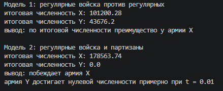

---
## Author
author:
  name: Сергей Витальевич Павлюченков
  email: 1132237372@rudn.ru
  affiliation:
    - name: Российский университет дружбы народов
      country: Российская Федерация
      postal-code: 117198
      city: Москва
      address: ул. Миклухо-Маклая, д. 6

## Title
title: "Отчёт по лабораторной работе № 3"
subtitle: "Модель боевых действий"
license: "CC BY"
---

# Цель работы

Рассмотри три случая ведения боевых действий:
1. Боевые действия между регулярными войсками
2. Боевые действия с участием регулярных войск и партизанских
отрядов
3. Боевые действия между партизанскими отрядами

# Задание

**Вариант 43.** Между страной X и страной Y идёт война. Численность войск исчисляется от начала войны и является функциями времени $x(t)$ и $y(t)$. В начальный момент времени страна X имеет армию численностью 227 000 человек, а в распоряжении страны Y армия численностью 139 000 человек. Для упрощения модели считаем, что коэффициенты $a, b, c, h$ постоянны, а $P(t)$ и $Q(t)$ — непрерывные функции.

Построить графики изменения численности армий X и Y для следующих случаев.

1. Модель боевых действий между регулярными войсками:
$$\begin{cases} \dfrac{dx}{dt} = 0{,}34x(t) + 0{,}87y(t) + \sin(t) + 2 \\ \dfrac{dy}{dt} = 0{,}5x(t) + 0{,}2y(t) + 2|\cos(t)| \end{cases}$$
2. Модель ведения боевых действий с участием регулярных войск и партизанских отрядов:
$$\begin{cases} \dfrac{dx}{dt} = 0{,}24x(t) + 0{,}75y(t) + \sin(8t) + 1 \\ \dfrac{dy}{dt} = 0{,}28x(t)y(t) + 0{,}18y(t) + 2|\cos(t)| \end{cases}$$

Начальные условия: $x(0) = 227\,000$, $y(0) = 139\,000$.

# Выполнение лабораторной работы

После создания файла и описания модели я запустил lab03_43.jl. 
После успешного роботокода я начал подбирать параметры, при которых тайная сторона начнет выигрывать. Так, например, на следующей картинке. ([рис. @fig-001]).
Училось так, что армия Y победила во всех случаях, в основном за счет преимущества в размере армии.

{#fig-001 width=70%}

В следующем случае меньшего количества я смог добиться того, что армия X победила во всех случаях. 

После чего взяв эффективный из варианта, подробнее на картинке = ([рис. @fig-003]).

{#fig-003 width=70%}

Я применил их, записал в код и получил следующие результаты. ([рис. @fig-004]).

{#fig-004 width=70%}



# Выводы

В ходе работы я научился задавать параметры модели, брызг, действий, численно решать подобные системы. Да, в двух системах были построены зависимости размера армии при начальных численности 227 тысяч человек и 129 тысяч человек. 