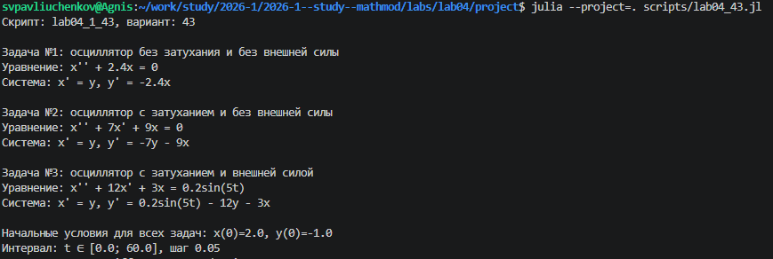
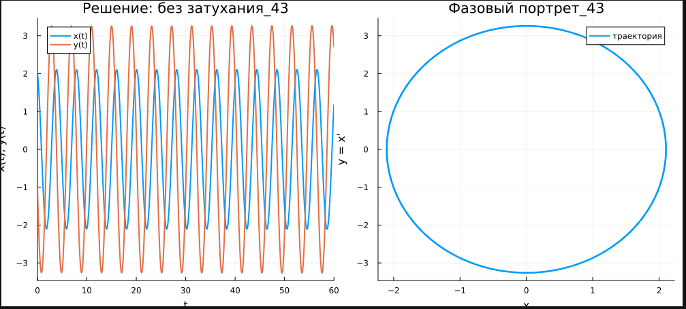
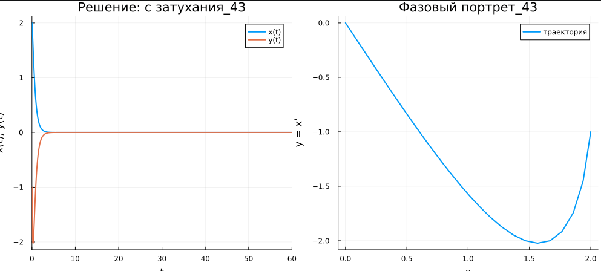
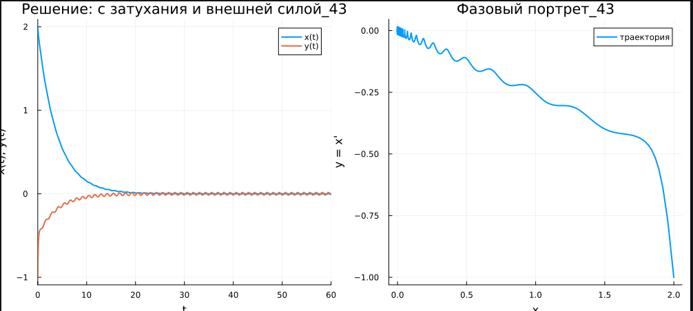

---
## Author
author:
  name: Сергей Витальевич Павлюченков
  email: 1132237372@rudn.ru
  affiliation:
    - name: Российский университет дружбы народов
      country: Российская Федерация
      postal-code: 117198
      city: Москва
      address: ул. Миклухо-Маклая, д. 6

## Title
title: "Отчёт по лабораторной работе № 4"
subtitle: "Модель гармонических колебаний"
license: "CC BY"
---

# Цель работы

Изучить модель гармонического осциллятора и построить фазовые портреты и решения для колебаний с затуханием И под действием внешних сил 

# Задание

**Вариант 43.** Построить фазовый портрет гармонического осциллятора и решение уравнения гармонического осциллятора для следующих случаев.

1. Колебания без затуханий и без действия внешней силы: $\ddot{x} + 2{,}4x = 0$.
2. Колебания с затуханием и без действия внешней силы: $\ddot{x} + 7\dot{x} + 9x = 0$.
3. Колебания с затуханием и под действием внешней силы: $\ddot{x} + 12\dot{x} + 3x = 0{,}2\sin(5t)$.

Решение строится на интервале $t \in [0; 60]$ с шагом $0{,}05$ при начальных условиях $x_0 = 2$, $y_0 = \dot{x}_0 = -1$.

# Выполнение лабораторной работы

Создадим код lab04_43.jl, запустим его([рис. @fig-001]).

{#fig-001 width=70%}

Всё, мы сканируем производные форматы с помощью tangle.jl. И выполним jupyter notebook.
После чего, открываем результирующие графики в папке plots/ - Случай 1: без затуханий и внешней силы([рис. @fig-002]).

{#fig-002 width=70%}

Получим, Случай 2: с затуханиями и без внешней силы ([рис. @fig-003]).

{#fig-003 width=70%}

Получим, Случай 3: с затуханий и внешней силы ([рис. @fig-004]).

{#fig-004 width=70%}

# Программная реализация



# Выводы

В ходе работы я научился сводить уравнение второго порядка к системе первого порядка, решать её численно и строить фазовые портреты гармонического осциллятора.