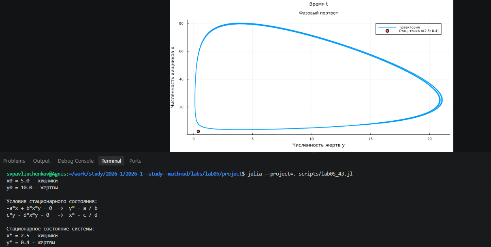

---
## Author
author:
  name: Сергей Витальевич Павлюченков
  email: 1132237372@rudn.ru
  affiliation:
    - name: Российский университет дружбы народов
      country: Российская Федерация
      postal-code: 117198
      city: Москва
      address: ул. Миклухо-Маклая, д. 6
## Title
title: Лабораторная работа №5
subtitle: Математическое моделирование
license: CC BY
date: today
date-format: "YYYY-MM-DD" # Example: 2025-09-06
---

## Докладчик

:::::::::::::: {.columns align=center}
::: {.column width="70%"}

  * Павлюченков Сергей Витальевич
  * Студент группы НКНбд-01-23
  * Российский университет дружбы народов им. П. Лумумбы

:::
::: {.column width="30%"}

:::
::::::::::::::

# Вводная часть

## Цель работы

Изучить модель «хищник-жертва» и построить график изменения численности популяции хищников и жертв, а также найти стационарное состояние системы. 

## Задание

**Вариант 43.** Для модели «хищник — жертва»:
$$\begin{cases} \dfrac{dx}{dt} = -0{,}19x(t) + 0{,}026x(t)y(t) \\ \dfrac{dy}{dt} = 0{,}18y(t) - 0{,}032x(t)y(t) \end{cases}$$
где $x(t)$ — численность хищников, $y(t)$ — численность жертв.

Построить график зависимости численности хищников от численности жертв, а также графики изменения численности хищников и жертв при начальных условиях $x_0 = 3$, $y_0 = 8$. Найти стационарное состояние системы.

# Выполнение лабораторной работы

## Получение параметров

Переписав формулы из лабораторной работы получаем в файл lab05_43.jl. Запустив его, найдем стационарное состояние системы. В данном случае это 25 и 4([рис. @fig-001]).

{#fig-001 width=70%}

## Создание производных файлов

Cоздадим производные файлы с помощью tangle.jl. ([рис. @fig-002]).

{#fig-002 width=70%}

# Результаты

## Построение фазового портрета вариант 43

{#fig-003 width=50%}

## Выводы

В ходе данной лабораторной работы я научился моделировать взаимодействие двух популяций, строить фазовый портрет систем «хищник-жертва» и находить ее стационарное состояние. 

