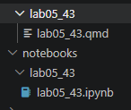
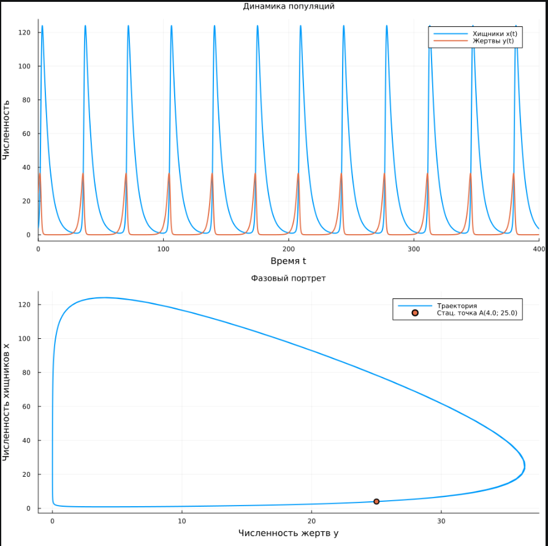

---
## Author
author:
  name: Сергей Витальевич Павлюченков
  email: 1132237372@rudn.ru
  affiliation:
    - name: Российский университет дружбы народов
      country: Российская Федерация
      postal-code: 117198
      city: Москва
      address: ул. Миклухо-Маклая, д. 6

## Title
title: "Отчёт по лабораторной работе № 5"
subtitle: "Модель хищник-жертва"
license: "CC BY"
---

# Цель работы

Изучить модель «хищник-жертва» и построить график изменения численности популяции хищников и жертв, а также найти стационарное состояние системы. 

# Задание

**Вариант 43.** Для модели «хищник — жертва»:
$$\begin{cases} \dfrac{dx}{dt} = -0{,}19x(t) + 0{,}026x(t)y(t) \\ \dfrac{dy}{dt} = 0{,}18y(t) - 0{,}032x(t)y(t) \end{cases}$$
где $x(t)$ — численность хищников, $y(t)$ — численность жертв.

Построить график зависимости численности хищников от численности жертв, а также графики изменения численности хищников и жертв при начальных условиях $x_0 = 3$, $y_0 = 8$. Найти стационарное состояние системы.

# Выполнение лабораторной работы

Переписав формулы из лабораторной работы получаем в файл lab05_43.jl. Запустив его, найдем стационарное состояние системы. В данном случае это 25 и 4 , в выводе была ошибка на порядок([рис. @fig-001]).

{#fig-001 width=70%}

Cоздадим производные файлы с помощью tangle.jl. ([рис. @fig-002]).

{#fig-002 width=70%}

После, взяв данные стационарные точки за начальное состояние найдем, получим следующие 2 графика([рис. @fig-003]).

{#fig-003 width=70%}

# Программная реализация



# Выводы

В ходе данной лабораторной работы я научился моделировать взаимодействие двух популяций, строить фазовый портрет систем «хищник-жертва» и находить ее стационарное состояние. 