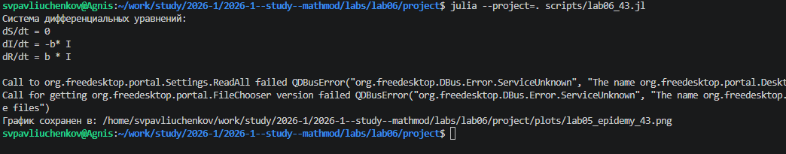
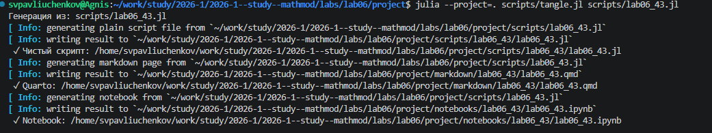
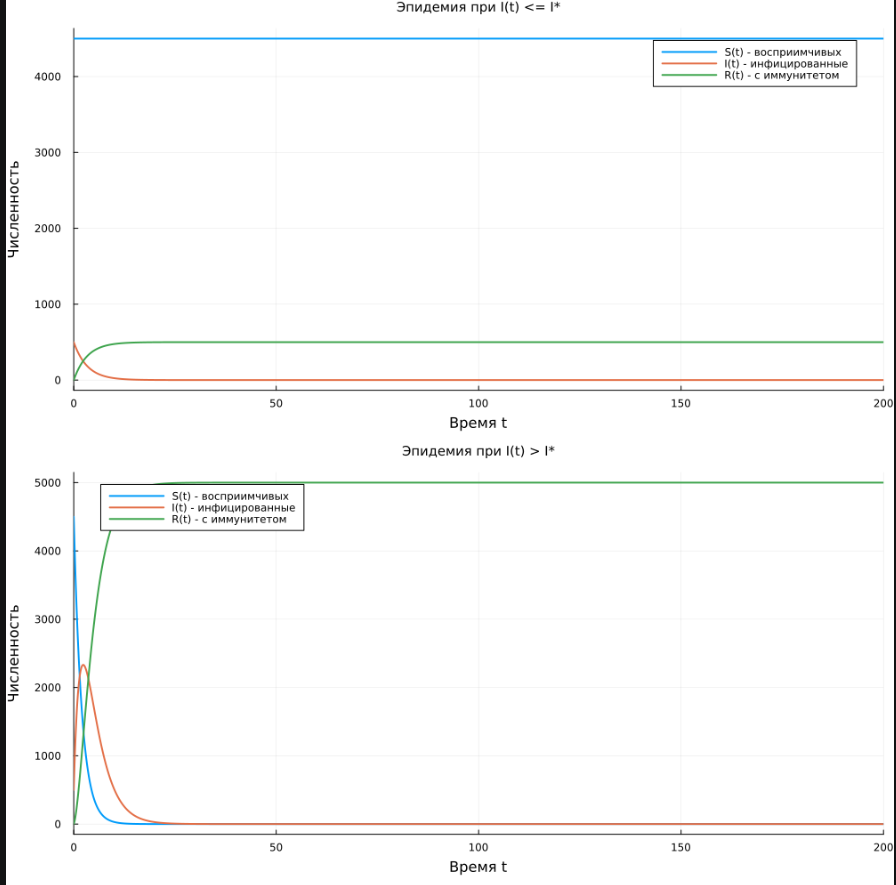
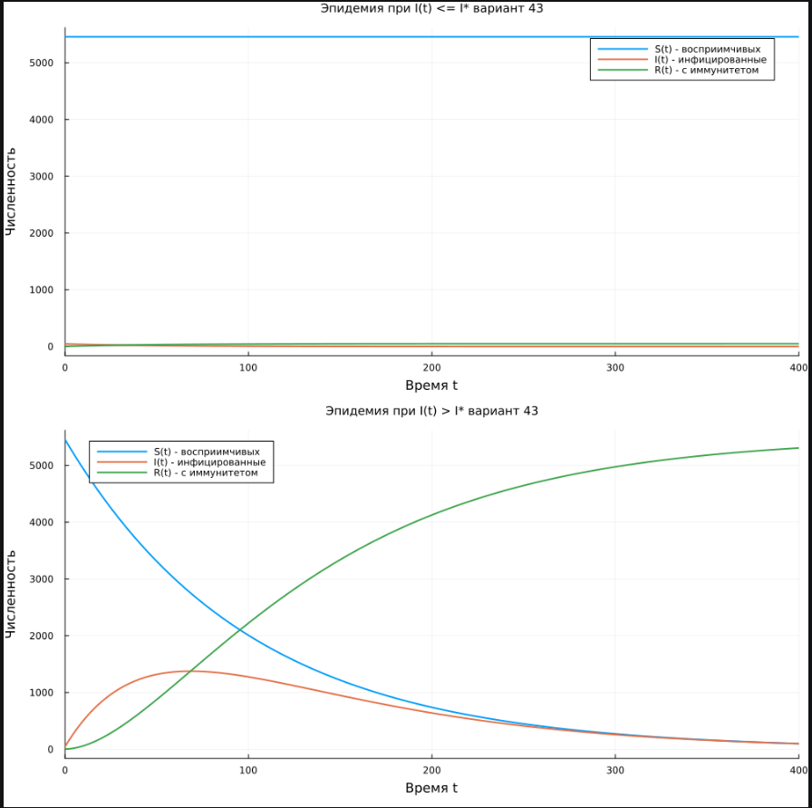

---
## Author
author:
  name: Сергей Витальевич Павлюченков
  email: 1132237372@rudn.ru
  affiliation:
    - name: Российский университет дружбы народов
      country: Российская Федерация
      postal-code: 117198
      city: Москва
      address: ул. Миклухо-Маклая, д. 6
## Title
title: Лабораторная работа №6
subtitle: Математическое моделирование
license: CC BY
date: today
date-format: "YYYY-MM-DD" # Example: 2025-09-06
---

## Докладчик

:::::::::::::: {.columns align=center}
::: {.column width="70%"}

  * Павлюченков Сергей Витальевич
  * Студент группы НКНбд-01-23
  * Российский университет дружбы народов им. П. Лумумбы

:::
::: {.column width="30%"}

:::
::::::::::::::

# Вводная часть

## Цель работы

Изучить модель распространения эпидемии и построить графики изменения численности восприимчивых, инфицированных и выздоровевших особей.

## Задание

**Вариант 43.** На одном острове вспыхнула эпидемия. Известно, что из всех проживающих на острове ($N = 5505$) в момент начала эпидемии ($t = 0$) число заболевших людей, являющихся распространителями инфекции, $I(0) = 45$, а число здоровых людей с иммунитетом к болезни $R(0) = 3$. Таким образом, число людей, восприимчивых к болезни, но пока здоровых, в начальный момент времени $S(0) = N - I(0) - R(0)$.

Построить графики изменения числа особей в каждой из трёх групп. Рассмотреть, как будет протекать эпидемия в случае:

1. $I(0) \le I^*$;
2. $I(0) > I^*$.

Динамика описывается системой
$$\frac{dS}{dt} = \begin{cases} -\alpha S, & I(t) > I^* \\ 0, & I(t) \le I^* \end{cases}, \quad
\frac{dI}{dt} = \begin{cases} \alpha S - \beta I, & I(t) > I^* \\ -\beta I, & I(t) \le I^* \end{cases}, \quad
\frac{dR}{dt} = \beta I.$$

# Выполнение

## Выполнение лабораторной работы

Переписываем уравнения из лабораторной работы, и, написав код, мы его запускаем и успешно создаем первый график. ([рис. @fig-001]).

{#fig-001 width=70%}

После создаем производные файлы для работы с .ipynb. ([рис. @fig-002]).

{#fig-002 width=70%}

# Результаты

## Два случая распространения

{#fig-003 width=45%}

## Два случая распространения вариант 43

{#fig-004 width=45%}

## Выводы

В ходе работы я научился моделировать течение эпидемии для разных начальных условий и анализировать изменение частоты заражения по времени. 

