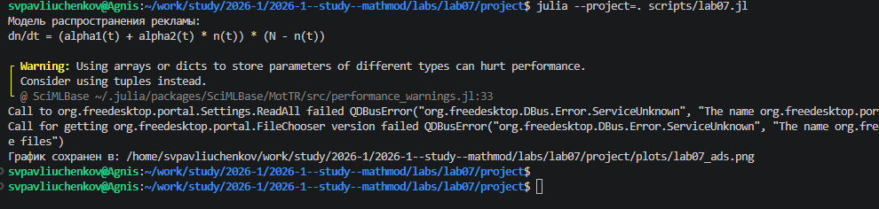
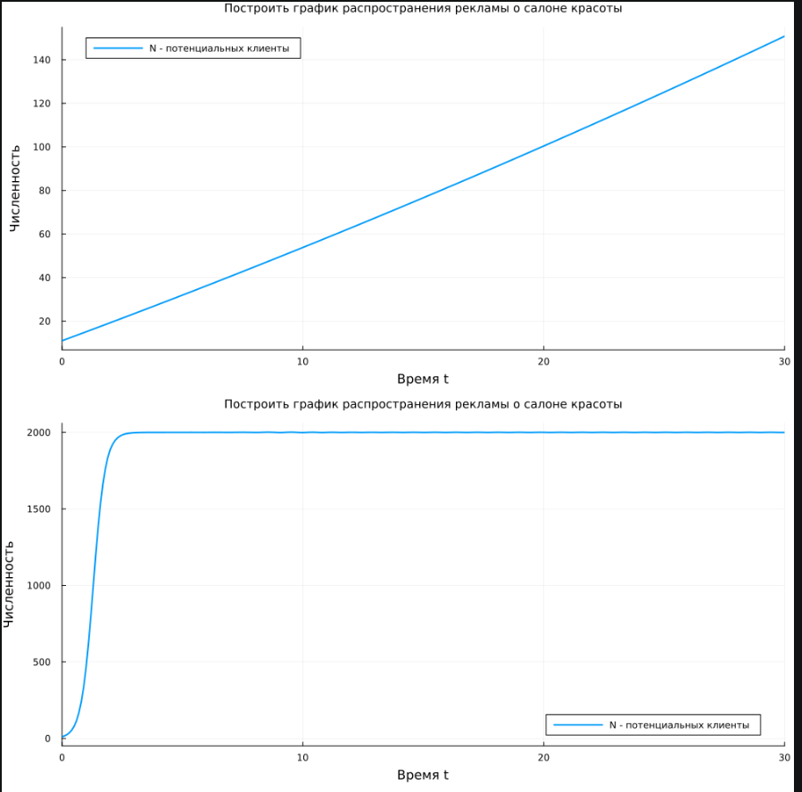
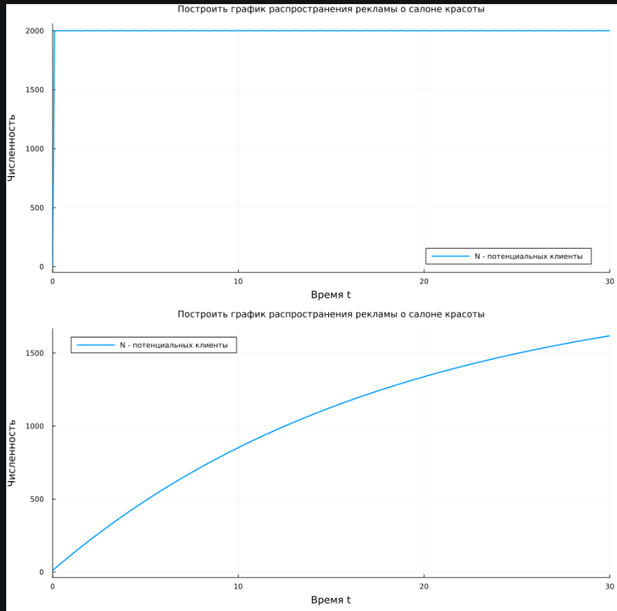
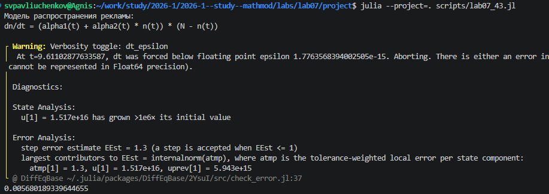
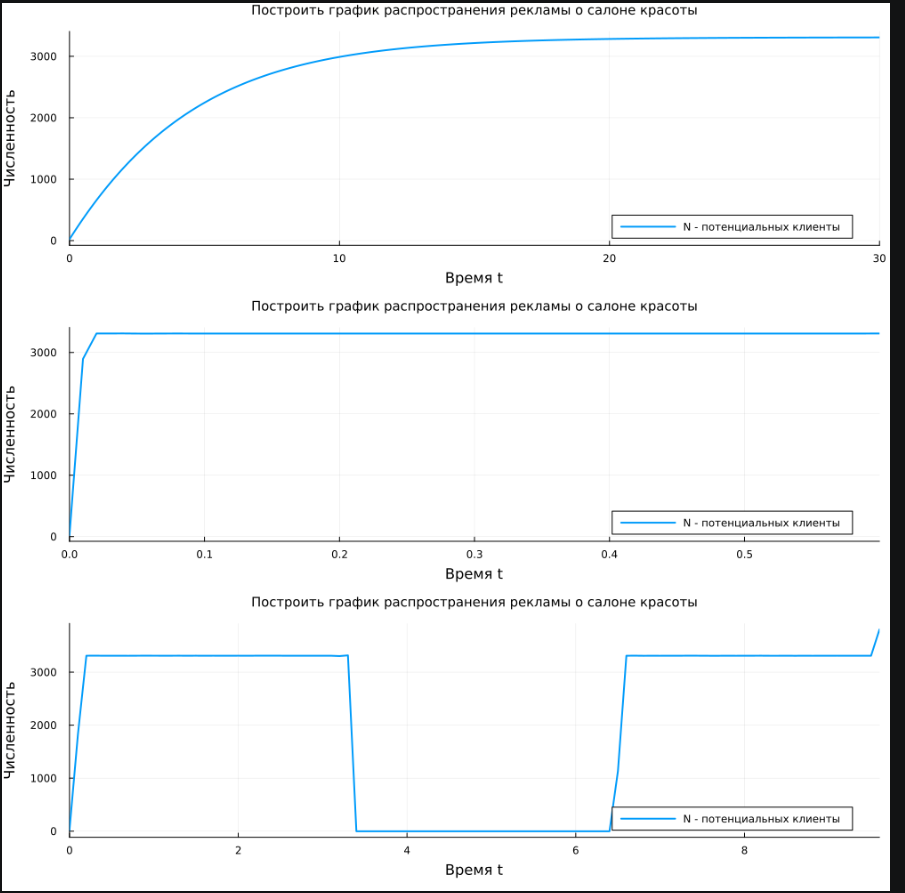

---
## Author
author:
  name: Сергей Витальевич Павлюченков
  email: 1132237372@rudn.ru
  affiliation:
    - name: Российский университет дружбы народов
      country: Российская Федерация
      postal-code: 117198
      city: Москва
      address: ул. Миклухо-Маклая, д. 6

## Title
title: "Отчёт по лабораторной работе № 7"
subtitle: "Эффективность рекламы"
license: "CC BY"
---

# Цель работы

Изучить модель распространения рекламы и сравнить влияние платной рекламы и «сарафанного радио» на рост числа информированных клиентов.

# Задание

**Вариант 43.** Построить график распространения рекламы, математическая модель которой описывается следующими уравнениями:

1. $\dfrac{dn}{dt} = (0{,}211 + 0{,}000011\ln(t))(N - n(t))$;
2. $\dfrac{dn}{dt} = (0{,}0000311 + 0{,}21\,n(t))(N - n(t))$;
3. $\dfrac{dn}{dt} = (0{,}511\sin(t) + 0{,}311\sin(t)\,n(t))(N - n(t))$.

Объём аудитории $N = 3310$, в начальный момент о товаре знают 22 человека. Для случая 2 определить, в какой момент времени скорость распространения рекламы будет иметь максимальное значение.

# Выполнение лабораторной работы

Создаем код лабораторной работы и выполняем ([рис. @fig-001]).

{#fig-001 width=70%}

Получаем следующий графки, в первом случае преобладает сарафанное радио, а во втором платная реклама. ([рис. @fig-002]).

{#fig-002 width=70%}

После чего мы повторяем тот же код, но один из альфа мы приравняем к нулю. И получаем еще более явный результат. Сарафанное радио показывает себя хорошо при условии, что количество контактов высокое. ([рис. @fig-003]).

{#fig-003 width=70%}



Теперь повторяем. Это же для данных из нашего варианта ([рис. @fig-004]). И дополнительно находим момент времени, в который эффективность рекламы имеет максимально быстрый рост. 

{#fig-004 width=70%}

 В первом случае коэффициент платной рекламы гораздо больше, чем коэффициент на радио. В целом, самки в целом низкие, что рост не слишком быстрый. В третьем случае вид графика таков: из-за синуса в функции. ([рис. @fig-005]).

{#fig-005 width=70%}

# Программная реализация



# Выводы

В ходе работы надо строить графики распространения информации о товаре и определять, при каких условиях реклама становится более эффективной. 