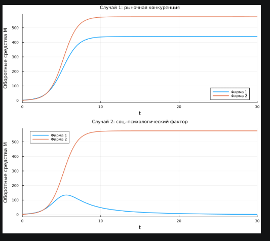
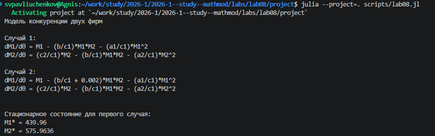
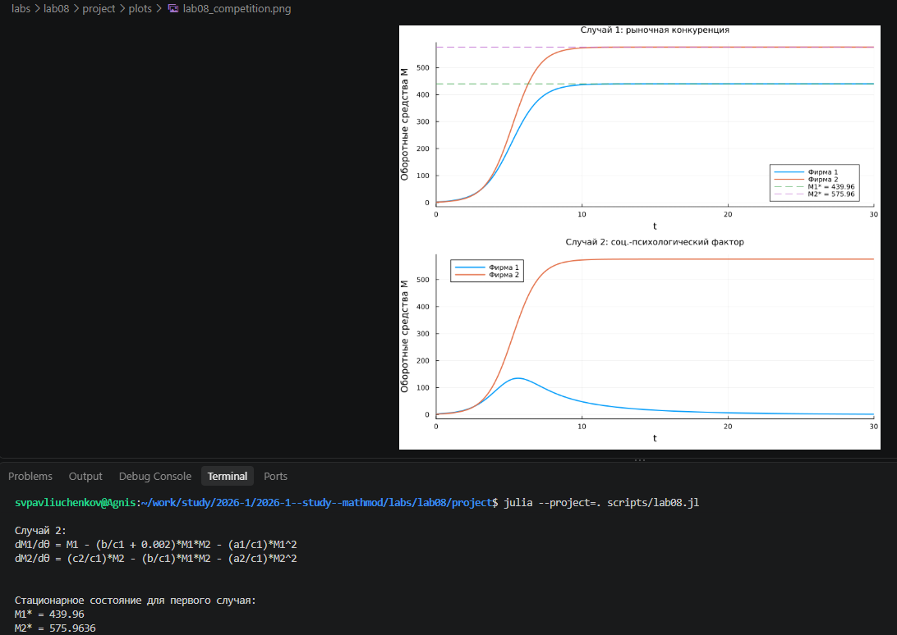
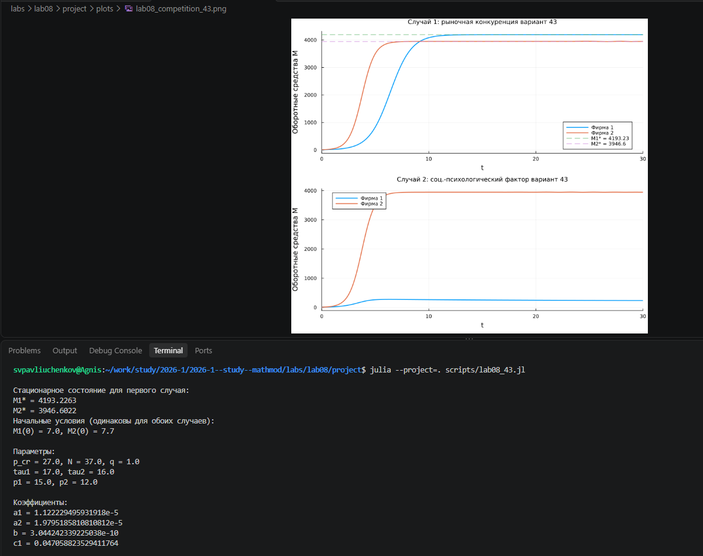
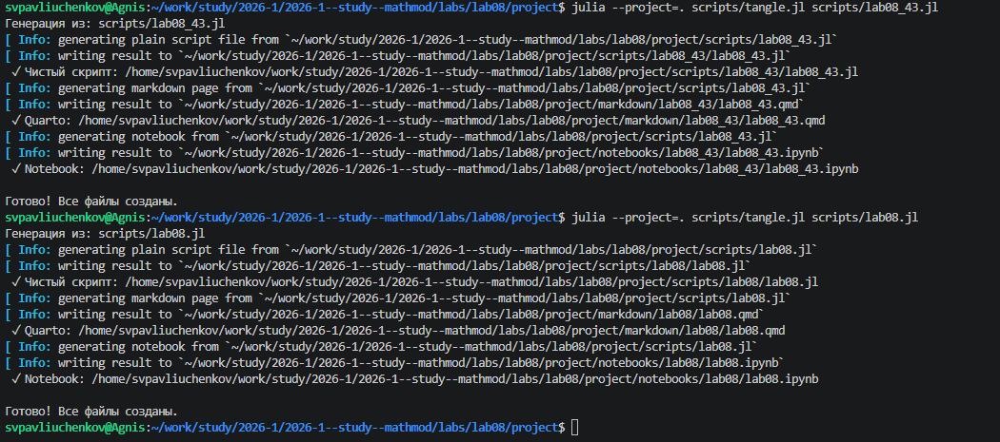
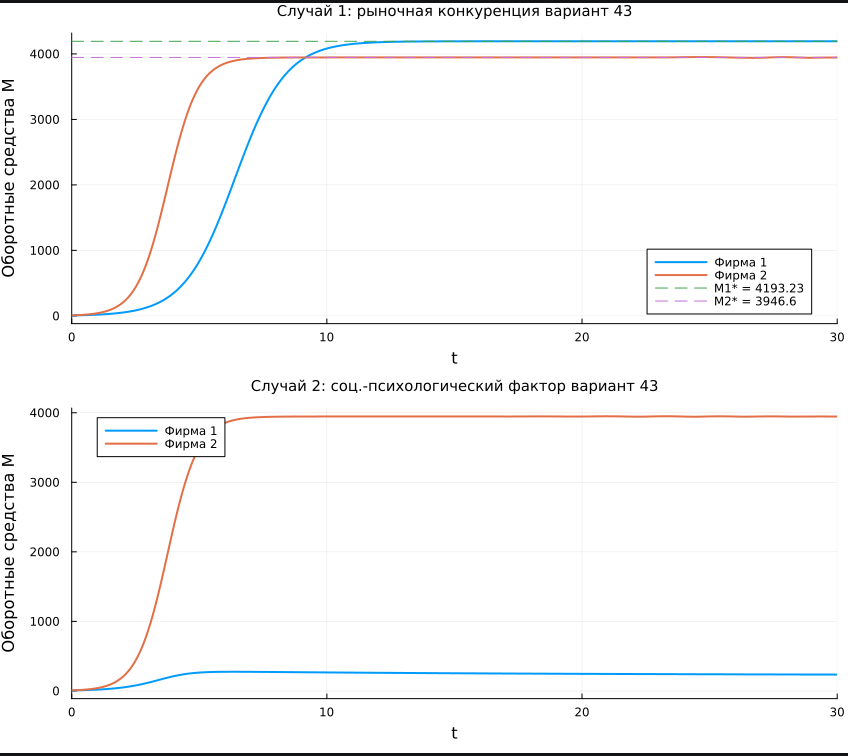

---
## Author
author:
  name: Сергей Витальевич Павлюченков
  email: 1132237372@rudn.ru
  affiliation:
    - name: Российский университет дружбы народов
      country: Российская Федерация
      postal-code: 117198
      city: Москва
      address: ул. Миклухо-Маклая, д. 6

## Title
title: "Отчёт по лабораторной работе № 8"
subtitle: "Модель конкуренции двух фирм"
license: "CC BY"
---

# Цель работы

Изучить модель конкуренции двух фирм и построить графики изменения их оборотных средств в разных условиях взаимодействия. 

# Задание

**Вариант 43.**

*Случай 1.* Рассматриваются две фирмы, производящие взаимозаменяемые товары одинакового качества и находящиеся в одной рыночной нише. Конкурентная борьба ведётся только рыночными методами: конкуренты могут влиять на противника путём изменения параметров своего производства (себестоимость, время цикла), но не могут прямо вмешиваться в ситуацию на рынке. Постоянными издержками пренебрегаем. Динамика объёмов продаж фирм 1 и 2 описывается системой
$$\begin{cases} \dfrac{dM_1}{d\theta} = M_1 - \dfrac{b}{c_1}M_1M_2 - \dfrac{a_1}{c_1}M_1^2 \\ \dfrac{dM_2}{d\theta} = \dfrac{c_2}{c_1}M_2 - \dfrac{b}{c_1}M_1M_2 - \dfrac{a_2}{c_1}M_2^2 \end{cases}$$
где
$$a_1 = \frac{p_{cr}}{\tau_1^2 \tilde{p}_1^2 Nq}, \quad a_2 = \frac{p_{cr}}{\tau_2^2 \tilde{p}_2^2 Nq}, \quad b = \frac{p_{cr}}{\tau_1^2\tau_2^2\tilde{p}_1^2\tilde{p}_2^2 Nq}, \quad c_1 = \frac{p_{cr} - \tilde{p}_1}{\tau_1\tilde{p}_1}, \quad c_2 = \frac{p_{cr} - \tilde{p}_2}{\tau_2\tilde{p}_2},$$
введена нормировка $t = c_1\theta$.

*Случай 2.* Помимо экономических факторов используются социально-психологические (формирование общественного предпочтения одного товара другому независимо от качества и цены). Взаимодействие фирм меняется, и коэффициент перед $M_1M_2$ в первом уравнении отличается:
$$\begin{cases} \dfrac{dM_1}{d\theta} = M_1 - \left(\dfrac{b}{c_1} + 0{,}00024\right)M_1M_2 - \dfrac{a_1}{c_1}M_1^2 \\ \dfrac{dM_2}{d\theta} = \dfrac{c_2}{c_1}M_2 - \dfrac{b}{c_1}M_1M_2 - \dfrac{a_2}{c_1}M_2^2 \end{cases}$$

Для обоих случаев: $M_1(0) = 7$, $M_2(0) = 7{,}7$; $p_{cr} = 27$, $N = 37$, $q = 1$; $\tau_1 = 17$, $\tau_2 = 16$, $\tilde{p}_1 = 15$, $\tilde{p}_2 = 12$. Значения $N$ указаны в тысячах единиц, а $M_{1,2}$ — в миллионах единиц.

Обозначения: $N$ — число потребителей продукта, $\tau$ — длительность производственного цикла, $p$ — рыночная цена товара, $\tilde{p}$ — себестоимость (переменные издержки на единицу продукции), $q$ — максимальная потребность одного человека в продукте в единицу времени, $\theta = t/c_1$ — безразмерное время.

1. Построить графики изменения оборотных средств фирм 1 и 2 без учёта постоянных издержек и с введённой нормировкой для случая 1. 2. То же для случая 2.

# Выполнение лабораторной работы

После написания кода и запускаем. Мы получили первые результаты для первого случая рыночной конкуренции. И открываем график в папке plots.  ([рис. @fig-001]).

{#fig-001 width=70%}

С помощью выведенного нами уравнения находим стационарные точки первого случая. ([рис. @fig-002]).

{#fig-002 width=70%}

Строим график сравнения двух случаев и на первых случаях также наносим стационарные точки. ([рис. @fig-003]).

{#fig-003 width=70%}



После чего создаем новый файл для нашего варианта и вставляем новые параметры ([рис. @fig-004]).

{#fig-004 width=70%}

Создаем производные файлы из кода ([рис. @fig-005]).

{#fig-005 width=70%}

Создаем график учета постоянных издержек с сведенной нормировкой для случая 1, для случая 2, для фирмы 1 и 2 ([рис. @fig-006]).

{#fig-006 width=70%}

# Программная реализация



# Выводы

В ходе работы я научился анализировать динамику конкуренции фирм, сравнивать результаты для разных случаев и находить стационарное состояние системы.